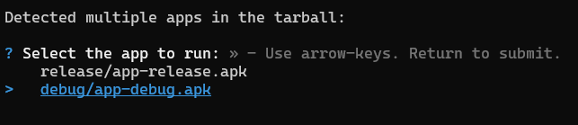

# GreenMind Android App

## UI design
App was designed entirely in Figma using [Material Design 3](https://m3.material.io/) 
framework.

[Figma design project](https://www.figma.com/file/T0IaA2ZHINZMKn7GitY2UO/GrowBox-Design?type=design&node-id=11%3A1833&mode=design&t=wfPJBGPbgukZsi7a-1).

## Introduction
This app was designed and created for an engineering project. 
The project's objective was to create a device for taking care of plants
and app for managing this device.

## Features
* Authentication and authorization using JWT.
* Different types of navigator like Stack, Drawer.
* Reading device parameters: air/soil humidity, temperature, and light intensity.
* Watering plants with a button click.
* Validating the watering queue to prevent overwatering.
* Bar charts for all device parameters for the last 7 days.
* Pairing devices with unique codes.
* CRUD operations for managing user devices.
* Private, public, favorite, and device-assigned plant lists.
* CRUD operations for all types of plants mentioned above.
* A multistep form for adding new plants.
* Dark and light themes.
* English and Polish languages, which can be changed in settings.

## Installation
### 1. Setup microservices
First, you need to set up following microservices: 
* [to be done]() (Ruby on Rails) using docker or locally on Linux
* [fastapi-microservice](https://github.com/finematte/fastapi-microservice) (Python, FastAPI)

### 2. Install necessary dependencies
```
npm install
```
### 3. Login to eas
You'll need eas account to create development build. 
I use them to make native libraries work with expo.
You can find more information about them here
[Create your first build](https://docs.expo.dev/build/setup/).

1. Install EAS CLI globally
```
npm install -g eas-cli
```
2. Login to your expo account
```
eas login
```
### 4. Run EAS build
After signing up, you can run following command to create development build
```
npm run build:prod-apk
```
Wait until your build is put on the queue. 
Progress can be tracked in the terminal or on expo.dev.


In the terminal, you will be prompted with a question. 
Type `Y` to install the app on the emulator


Select the `debug/app-debug.apk` application in the terminal



In case of problems related to ADB, uninstall your app with following command:
```
adb uninstall growbox-app-v2
```

Download .tar file with app .apk from expo.dev:


Extract all and go to debug directory.
Then, install it manually with following command:
```
adb install ./app-debug.apk
```

Now, you should be ready to go.

## Development
### 1. How to run
Run app with development environment variables:
```
npm run start:local
```

Run app with production environment variables:
```
npm run start:prod
```
### 2. Environment variables:
For development environment, you need to provide your machine IP address.
It is needed due to our docker network configuration.
```
EXPO_PUBLIC_API_URL=http://your.ip.address:3000/api/v1/
EXPO_PUBLIC_IP_ADDRESS=your.ip.address
```